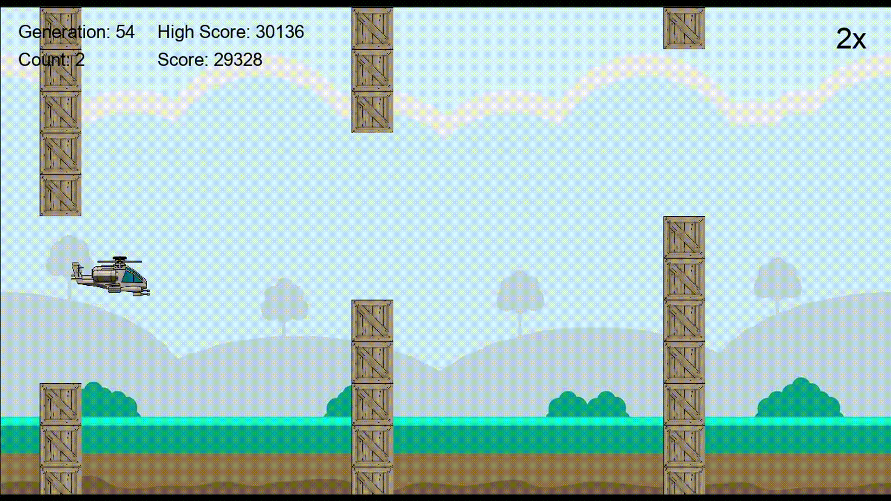
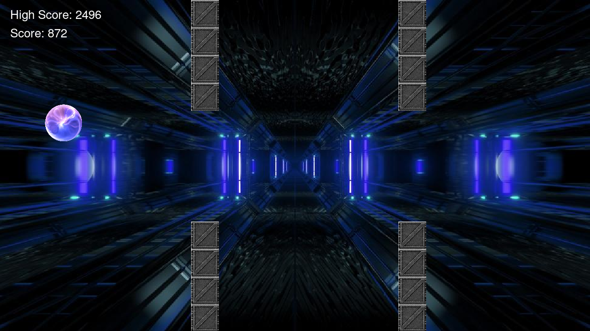
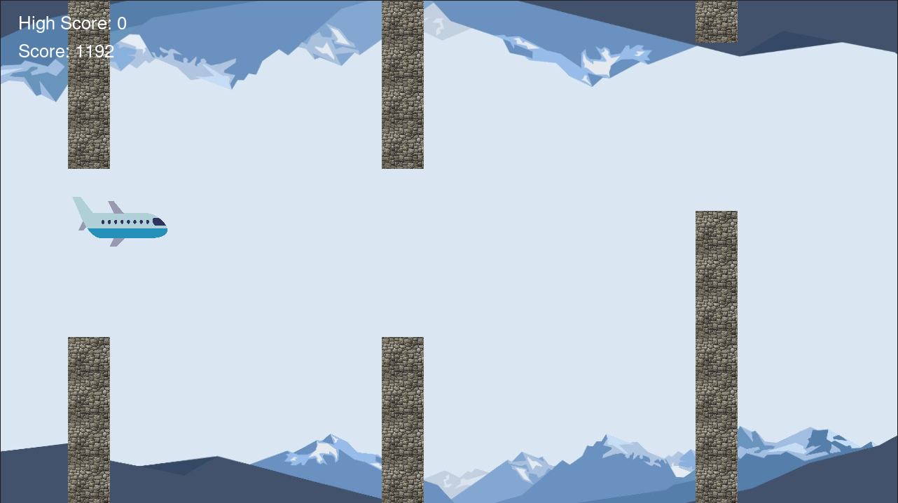

# Evolucop
Evolocop is an evolutionary agent that masters a simplistic helicopter game. It uses a three layers neural net, to choose wether to push the helicopter. The challenge is in training the net. There are many ways to train a network that can solve this effectively. As the name suggests Evolocop uses Evolution. See section below for how it works. 

## Game play
**takes some time to load!**
<p align="center"> 
     
</p>

## How it works
Each helicopter is associated with a three layer neural net. The network takes distance between current position of the agent and the next two middle points and returns a number between 0 and 1. If it's higher than 0.5 the space bar is pushed and helicopter moves up. Evolution works following evolution paradigm: 
- There are 150 helicopters at each generation 
- Parents are chosen using a selection scheme (you can use available schemes in selection module, here I used q_tournament)
- Crossover is performed by intertwining the columns of weight matrices
- Each child is mutated by adding gaussian noise to weight matrices (you must tune the hyperparameters for this step) 
- Game is run and next generation is selected (I used roulette wheel selection)

## Other modes 
Other modes includes `gravity` and `thrust`. Everything's the same except the GUI. You can even use helicopter checkpoints. 

<p align="center"> 
     
     
</p>

## Instructions
```
python game.py [OPTIONS]

--mode [thrust,gravity,helicopter] default helicopter 
    specifies the GUI environment
--checkpoint [checkpoint/helicopter/number]
    loads the generation given checkpoint
--play [False,True] default False
    you can play the game if set to True 
```

## Shortcuts 
- Press `d` to double evolution speed 
- Press `s` to only see one helicopter in evolution 
- Press Esc to exit evolution 
- Press `f` to see frame rate

## Acknowledgements 
This was part of a course on Computational Intelligence at Amirkabir university of Technology. I was only responsible for network architecture and implementation of evolutionary algorithms. Game logic and GUI were implemented [here](https://github.com/HosseinZaredar/EvolutionaryGames). There are TODOs in place for you to fill out and make your own Evolocop much like I did!
